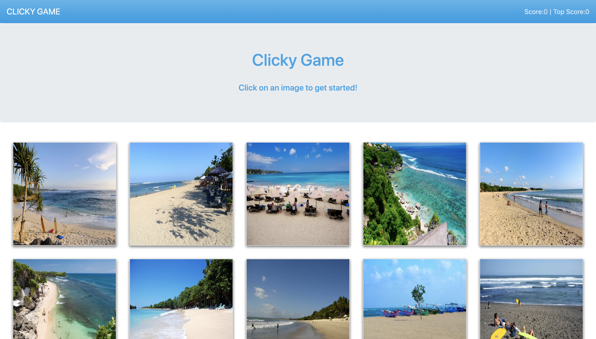

# Clicky-Game
React memory game

Clicky game is a memory game built with React.js and deployed in a Docker container using AWS Elastic Beanstalk. To play the game, users are presented with a series of beach photos and try not to click the same picture twice. Upon each successful click, the user's score increases by one point. If users get more successful clicks than their top score, a new top score is set.

# Deployment
The application is deployed in a Docker container using AWS Elastic Beanstalk @ http://clickygame-env.pxk2ww3yfs.us-east-1.elasticbeanstalk.com/

# Built With
Docker
Nginx
Amazon Web Services
React.js
React-Bootstrap - The CSS framework used.  

# Authors
Tony Bee